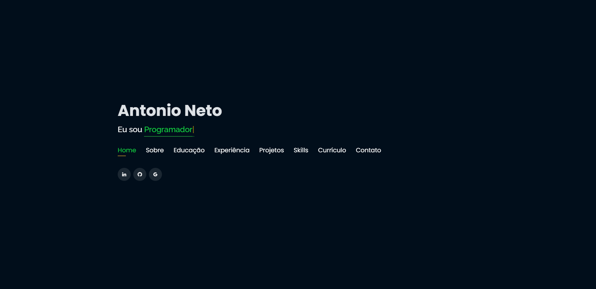
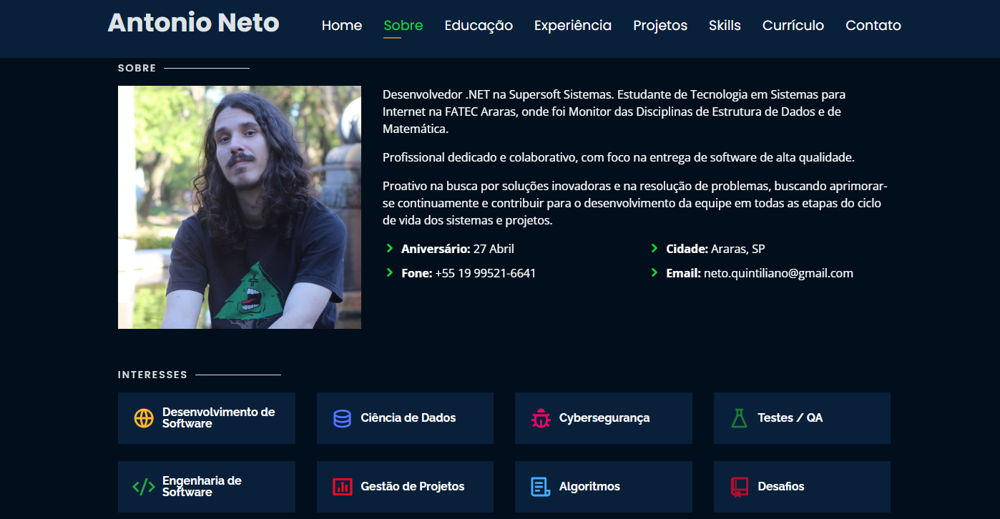
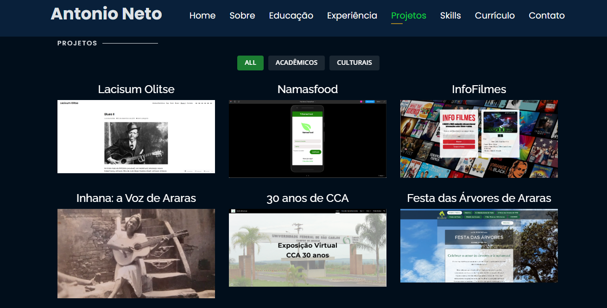

# Personal Portfolio 🔥
> https://antonioqneto.github.io/

### Website Preview
#### Home Page

#### About Page

#### Projects Page

  

:star: Star me on GitHub — it helps!

## Sobre
Portfolio Pessoal baseado em https://github.com/rajaprerak/rajaprerak.github.io

## Features 📋
⚡️ Completamente responsivo\
⚡️ HTML5 & CSS3 Válidos\
⚡️ Animação de digitação usando `Typed.js`\
⚡️ Facilmente modificável

## Instalação & Deploy 📦
- Clone o repositório e modifique o conteúdo de <b>index.html</b> 
- Adicione ou remova images do diretório `assets/img/` conforme seus requisitos.
- Atualize as informações da pasta `projects` de acordo com suas necessidades
- Use [Github Pages](https://pages.github.com/) para criar seu próprio website - instruções no link!.
- Para deploy de seu website, crie um repositório com o nome `<seu-usuario-github>.github.io` e empurre(push) seu código na branch princial branch `main` | `master`.

## Seções 📚
✔️ Sobre\
✔️ Interesses\
✔️ Educação\
✔️ Certificações\
✔️ Experiência\
✔️ Projetos \
✔️ Skills \
✔️ Currículo\
✔️ Informações de Contato

## Ferramentas utilizadas 🛠️
* <b>GitHub Pages</b> - To host my static website (HTML, CSS, JS).

## Contribuindo 💡

#### Passo 1

- **Opção 1**
    - 🍴 Fork esse repositório!

- **Opção 2**
    - 👯 Clone esse repositório em sua máquina local.

#### Passo 2

- **Construa seu código** 🔨🔨🔨

#### Passo 3

- 🔃 Crie um novo pull request.

## Licença

- **[MIT license](http://opensource.org/licenses/mit-license.php)**
